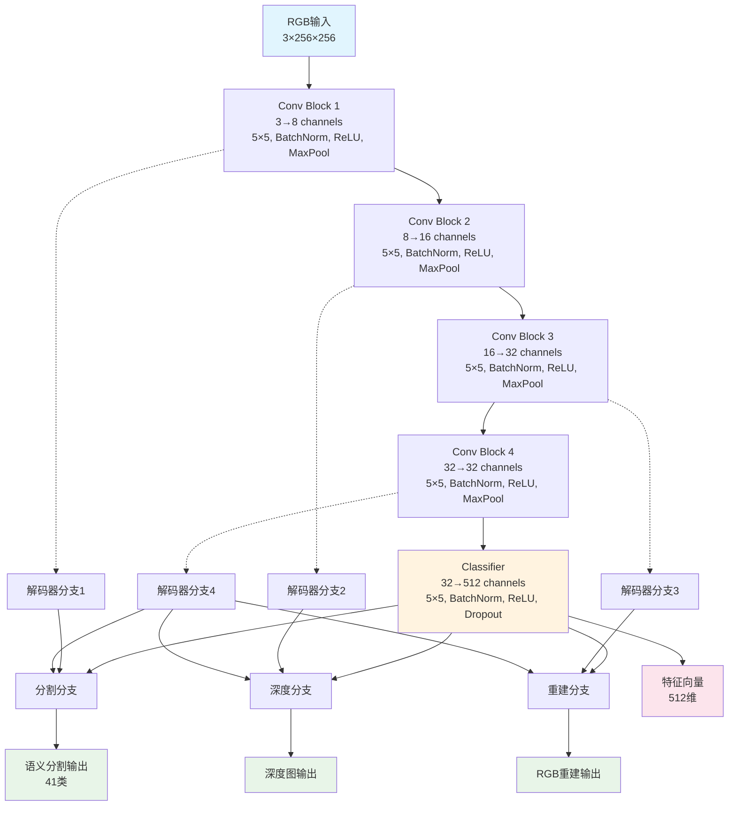
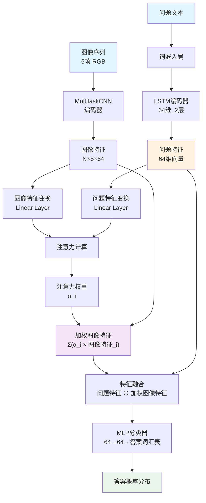
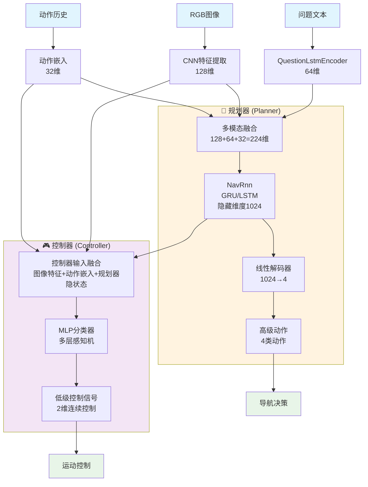
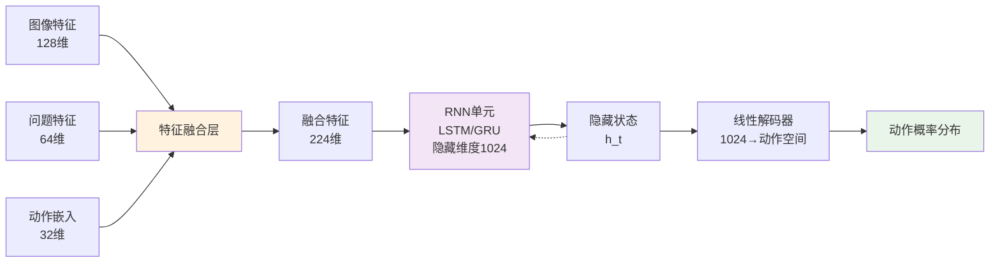
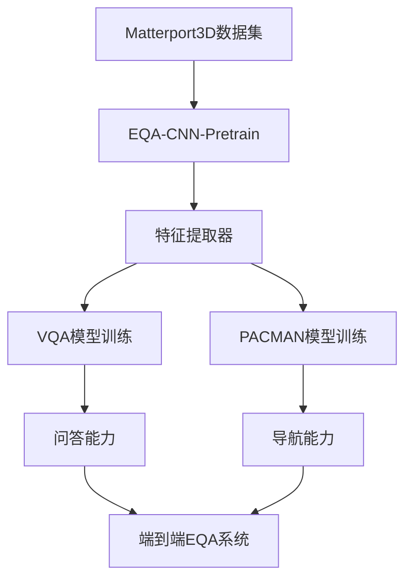

# Habitat-Baselines IL (Imitation Learning) 模块思维导图

## 📋 总体概述
- **模块名称**: Imitation Learning (IL)
- **主要任务**: Embodied Question Answering (EQA)
- **基于论文**: EmbodiedQA (Das et al. CVPR 2018)
- **核心思想**: 通过模仿学习训练智能体在3D环境中导航并回答问题

---

## 🏗️ 整体架构

### 三阶段训练流程
```
阶段1: EQA-CNN-Pretrain (特征提取器预训练)
    ↓
阶段2: 独立训练两个模块
    ├── VQA模型 (视觉问答)
    └── PACMAN模型 (导航)
    ↓
阶段3: 导航模型微调
```

---

## 🧠 核心模型架构

### 1. MultitaskCNN (多任务CNN)
**功能**: 编码器-解码器网络，用于特征提取

#### 网络结构图


#### 特点
- 使用跳跃连接融合多尺度特征
- 支持仅编码器模式用于特征提取
- 可加载预训练权重并冻结参数

### 2. VqaLstmCnnAttentionModel (VQA模型)
**功能**: 基于问题和图像序列预测答案

#### 模型架构图


#### 工作流程
1. CNN提取5帧图像特征 (N×5×64)
2. LSTM编码问题为固定长度向量
3. 计算问题-图像注意力权重
4. 加权融合图像特征
5. 问题特征与加权图像特征相乘
6. MLP分类器输出答案概率

### 3. NavPlannerControllerModel (PACMAN导航模型)
**功能**: 分层导航架构，包含规划器和控制器

#### 分层架构图


#### NavRnn核心组件详图


#### 双层架构特点
- **规划器 (Planner)**:
  - 输入: 图像特征 + 问题特征 + 动作历史
  - 输出: 高级动作决策 (4类动作)
  - 网络: NavRnn (GRU/LSTM)
  
- **控制器 (Controller)**:
  - 输入: 图像特征 + 动作嵌入 + 规划器隐状态
  - 输出: 低级控制信号 (2维连续控制)
  - 网络: MLP分类器

---

## 📊 数据处理

### 数据集类型
1. **EQACNNPretrainDataset**: 用于CNN预训练
   - RGB图像、深度图、语义分割标签
   
2. **EQADataset**: 用于VQA训练
   - 问题-答案对、图像序列 (5帧)
   - 词汇表: 问题词汇、答案词汇
   
3. **NavDataset**: 用于导航训练
   - 专家轨迹、动作序列、图像序列
   - 分层标注: 规划器动作 + 控制器动作

### 数据预处理
- **图像**: 256×256 RGB标准化
- **问题**: 词汇表编码，填充到固定长度
- **动作**: 离散动作编码 + 序列长度记录

---

## 🎯 训练策略

### 1. EQA-CNN-Pretrain训练
- **损失函数**:
  ```
  总损失 = 分割损失 + 10×重建损失 + 10×深度损失
  ```
- **优化器**: Adam
- **特点**: 多任务学习，提升特征表示能力

### 2. VQA模型训练
- **损失函数**: CrossEntropyLoss
- **评估指标**:
  - 准确率 (Accuracy)
  - 平均排名 (Mean Rank)
  - 平均倒数排名 (Mean Reciprocal Rank)
- **特点**: 可选择冻结CNN编码器

### 3. PACMAN导航训练
- **损失函数**: MaskedNLLCriterion (处理变长序列)
- **双重损失**:
  - 规划器损失: 高级动作预测
  - 控制器损失: 低级控制预测
- **特点**: 分层监督学习

---

## 📈 评估指标

### VQA评估 (VqaMetric)
- **准确率**: Top-1预测正确率
- **排名指标**: 
  - Mean Rank: 正确答案的平均排名
  - Mean Reciprocal Rank: 倒数排名的平均值

### 导航评估 (NavMetric)
- **规划器损失**: 高级动作预测损失
- **控制器损失**: 低级控制预测损失

### 通用指标框架 (Metric基类)
- **统计模式**: 
  - 累积平均 (模式0)
  - 指数移动平均 (模式1)
  - 当前值 (模式2)
- **日志记录**: JSON格式保存训练统计

---

## 🔧 技术特点

### 模型设计亮点
1. **分层架构**: 规划器-控制器分离，提升导航性能
2. **注意力机制**: VQA模型中的问题-图像注意力
3. **多任务学习**: CNN预训练阶段的多任务目标
4. **模块化设计**: 各组件可独立训练和评估

### 工程实现特点
1. **灵活配置**: 支持冻结预训练模型参数
2. **序列处理**: 使用pack_padded_sequence处理变长序列
3. **可视化支持**: 结果保存和TensorBoard日志
4. **设备适配**: 自动GPU/CPU设备选择

---

## 📁 文件结构
```
il/
├── README.md              # 详细使用说明
├── requirements.txt        # 依赖包 (lmdb>=0.98)
├── metrics.py             # 评估指标实现
├── models/
│   └── models.py          # 所有模型架构定义
└── trainers/
    ├── eqa_cnn_pretrain_trainer.py  # CNN预训练器
    ├── vqa_trainer.py              # VQA训练器
    └── pacman_trainer.py           # 导航训练器
```

---

## 🎮 使用场景

### 适用任务
- **Embodied Question Answering**: 在3D环境中导航并回答问题
- **视觉问答**: 基于图像序列的问答任务
- **导航规划**: 基于视觉和语言指令的导航

### 应用领域
- 室内机器人导航
- 虚拟助手交互
- 具身AI研究
- 多模态理解任务

---

## 📊 模型架构可视化图表

为了更好地理解IL模块的架构和训练流程，我们提供了以下SVG格式的可视化图表：

### 核心模型架构图

1. **MultitaskCNN架构图** (`MultitaskCNN_架构图.svg`)
   - 展示编码器-解码器结构
   - 包含跳跃连接和多任务输出分支
   - 详细的特征提取和重建流程

2. **VQA模型架构图** (`VQA_模型架构图.svg`)
   - 图像序列和问题文本的双路输入处理
   - 注意力机制的详细计算流程
   - 多模态特征融合和分类器设计

3. **PACMAN导航模型架构图** (`PACMAN_导航模型架构图.svg`)
   - 分层架构：规划器和控制器的双层设计
   - NavRnn核心组件的详细结构
   - 多模态输入融合和分层控制策略

### 训练流程图

4. **IL模块训练流程图** (`IL_模块训练流程图.svg`)
   - 完整的三阶段训练流程
   - 数据流和模型依赖关系
   - 训练配置和命令示例
   - 关键特点和技术要求

### 图表特点

- **SVG格式**: 矢量图形，支持无损缩放
- **颜色编码**: 不同组件使用不同颜色区分
- **详细标注**: 包含维度信息、参数配置等技术细节
- **层次清晰**: 从输入到输出的完整数据流
- **易于理解**: 结合图形和文字说明，便于学习和研究

这些可视化图表将帮助开发者和研究者更好地理解EmbodiedQA系统的内部架构、数据流动过程和训练策略。

---

## 🔄 训练流水线



这个IL模块实现了完整的具身问答系统，通过模仿学习的方式训练智能体在复杂3D环境中进行多模态理解和交互。